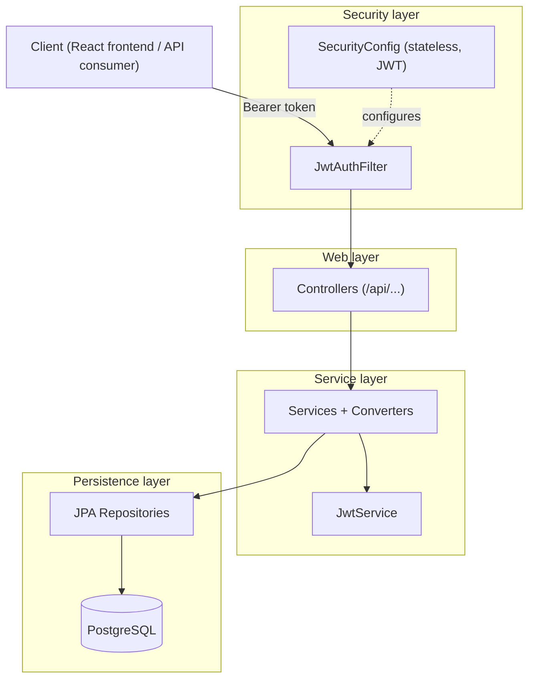

<div align="center">

# SijiUsu Server 🎓

**A JWT-secured REST API for campus academic management — users, faculties, majors, courses, sections, and enrollment.**

[](https://spring.io/projects/spring-boot)
[](https://www.oracle.com/java/)
[](https://www.postgresql.org/)
[](https://spring.io/projects/spring-security)
[](https://gradle.org/)
[](./LICENSE)

</div>

SijiUsu Server is the backend that powers a campus academic information system. It
exposes a clean, role-based REST API for managing users (admins, lecturers, and
students) and the full academic hierarchy — faculties, majors/departments, rooms,
courses, and course sections — along with student and lecturer enrollment. Security
is handled with JSON Web Tokens (access + refresh) on top of Spring Security.

> 🔗 **Frontend (React):** [BintangAull/siji-usu-frontend](https://github.com/BintangAull/siji-usu-frontend)

---

## Table of Contents

- [Overview](#overview)
- [Features](#features)
- [Tech Stack](#tech-stack)
- [Architecture](#architecture)
- [Project Structure](#project-structure)
- [Getting Started](#getting-started)
  - [Prerequisites](#prerequisites)
  - [Configuration](#configuration)
  - [Build & Run](#build--run)
  - [Seeded Data](#seeded-data)
- [API Reference](#api-reference)
  - [Authentication](#authentication)
  - [Admin – User Management](#admin--user-management)
  - [Admin – Academic Management](#admin--academic-management)
  - [Student](#student)
  - [Lecturer](#lecturer)
- [Related Repositories](#related-repositories)
- [Team](#team)
- [License](#license)

---

## Overview

The server models a university's academic structure and the people in it. Three
roles — **Admin**, **Lecturer**, and **Student** — each get a tailored set of
endpoints. Admins manage users and the academic catalog; lecturers and students
view their profiles and enroll into course sections. All protected endpoints are
guarded by stateless JWT authentication, and passwords are stored as bcrypt
hashes.

A built-in data seeder bootstraps the database with the real faculty/major
structure of a university plus sample users, courses, and sections, so the API is
immediately usable after first run. Visiting the server root (`/`) redirects to a
bundled HTML version of this API documentation (`/readme.html`).

## Features

| Feature | Description |
|---|---|
| **🔐 JWT authentication** | Login issues a short-lived access token (15 min) and a refresh token (7 days); refresh tokens are persisted and can be revoked on logout. |
| **🧹 Token cleanup** | Expired refresh tokens are cleaned up automatically by a scheduled service. |
| **👥 Role-based access** | Distinct API surfaces for Admin, Lecturer, and Student roles. |
| **👨‍🏫 User management** | Admins create and update lecturers and students, and list all users. |
| **🏛️ Academic catalog** | Full CRUD-style management of faculties, majors/departments, rooms, courses, and course sections. |
| **📝 Enrollment** | Students and lecturers can browse available sections and enroll. |
| **🧑‍🏫 Academic advisors** | Students are linked to an academic advisor (a lecturer). |
| **🔑 Password management** | Authenticated users can change their password with validation rules. |
| **🔒 bcrypt hashing** | Passwords are hashed using bcrypt via Spring Security. |
| **🌱 Data seeding** | First run seeds faculties, majors, sample users, courses, and sections. |
| **🌐 CORS-ready** | Pre-configured CORS for local development and deployment origins. |

## Tech Stack

- **Java 21** — language and toolchain.
- **Spring Boot 3.4.5** — application framework and auto-configuration.
- **Spring Web (MVC)** — REST controllers; all `@RestController`s are auto-prefixed with `/api`.
- **Spring Security** — stateless, JWT-based authentication and authorization.
- **Spring Data JPA (Hibernate)** — persistence and entity mapping.
- **Spring Validation (Bean Validation)** — request payload validation.
- **PostgreSQL** — relational database.
- **JJWT (io.jsonwebtoken)** — JWT creation and verification.
- **bcrypt (Spring Security Crypto)** — password hashing.
- **Gradle (Kotlin DSL)** — build system and dependency management.

## Architecture

The codebase is organized by **domain feature** (auth, admin, lecturer, student,
and shared core), each following a layered **Controller → Service → Repository →
Entity** flow. A `JwtAuthFilter` validates the access token on every request
before it reaches the controllers.



## Project Structure

A high-level view of the main source set:

```text
src/main/java/com/sanalab/sijiusu/
├─ auth/         # Authentication: JWT filter/service, login, refresh tokens, User model
├─ core/         # Shared infrastructure: config (security, CORS, paths), converters,
│                #   academic entities & repositories, validation, helpers, data seeder
├─ siji_admin/   # Admin APIs: user management + academic management
├─ siji_lecturer/# Lecturer APIs: profile and section enrollment
├─ siji_student/ # Student APIs: profile and section enrollment
└─ SijiUsuApplication.java

src/main/resources/
├─ application.example.yaml  # Template configuration (copy to application.yaml)
└─ static/readme.html        # Served API documentation
```

## Getting Started

### Prerequisites

- **JDK 21** or later.
- **Gradle 8.14** or later (or use the bundled `./gradlew` wrapper).
- A running **PostgreSQL** instance.

### Configuration

1. Create an empty PostgreSQL database:
   ```sql
   CREATE DATABASE db_name;
   ```
2. Copy the example configuration and fill in your own values:
   ```bash
   cp src/main/resources/application.example.yaml src/main/resources/application.yaml
   ```
3. Edit `application.yaml`:
   - `DATABASE_NAME`, `USERNAME`, `PASSWORD` — your PostgreSQL connection details.
   - `BASE64_JWT_SECRET` — a Base64-encoded secret (256-bit / 32 plain characters minimum).

   ```yaml
   spring:
     datasource:
       url: jdbc:postgresql://localhost:5432/${DATABASE_NAME}
       username: ${USERNAME}
       password: ${PASSWORD}
   jwt:
     secret: ${BASE64_JWT_SECRET}
   server:
     port: 8080
   ```

### Build & Run

```bash
# Clone the repository
git clone https://github.com/andreasmlbngaol/siji-usu-server.git
cd siji-usu-server

# Run the application
./gradlew bootRun

# Or build a runnable JAR
./gradlew build
```

The server starts on **http://localhost:8080**, and the root URL redirects to the
bundled API documentation at `/readme.html`.

### Seeded Data

On first run (when the database is empty), the app seeds the full university
faculty/major structure plus sample users, courses, and sections. A default admin
is created for initial access:

| Field | Value |
|---|---|
| Email | `admin@example.com` |
| Password | `test` |

> ⚠️ Change the default admin password after your first login.

## API Reference

All endpoints are prefixed with `/api`. Protected endpoints require an
`Authorization: Bearer {access_token}` header. Public endpoints are
`POST /api/auth/login` and `POST /api/auth/refresh` (plus the root and
`/readme.html`).

### Endpoint Summary

**Authentication**

| Method | Endpoint | Description |
|---|---|---|
| POST | `/api/auth/login` | Login and obtain access & refresh tokens |
| POST | `/api/auth/refresh` | Refresh access token using a refresh token |
| POST | `/api/auth/logout` | Logout and invalidate the refresh token |
| PATCH | `/api/auth/password` | Change password |

**Admin – User Management**

| Method | Endpoint | Description |
|---|---|---|
| GET | `/api/admins` | Get current admin |
| POST | `/api/admins/users/lecturers` | Create a new lecturer |
| GET | `/api/admins/users/lecturers` | Get all lecturers |
| GET | `/api/admins/users/lecturers/{id}` | Get lecturer by id |
| PATCH | `/api/admins/users/lecturers/{id}` | Update lecturer by id |
| POST | `/api/admins/users/students` | Create a new student |
| GET | `/api/admins/users/students` | Get all students |
| GET | `/api/admins/users/students/{id}` | Get student by id |
| PATCH | `/api/admins/users/students/{id}` | Update student by id |
| GET | `/api/admins/users` | Get all users |
| GET | `/api/admins/users/{id}` | Get user by id |

**Admin – Academic Management**

| Method | Endpoint | Description |
|---|---|---|
| POST | `/api/admins/academic/faculties` | Create a new faculty |
| GET | `/api/admins/academic/faculties` | Get all faculties |
| GET | `/api/admins/academic/faculties/{faculty_id}` | Get faculty by id |
| PATCH | `/api/admins/academic/faculties/{faculty_id}` | Update faculty by id |
| POST | `/api/admins/academic/faculties/{faculty_id}/majors` | Create a major within a faculty |
| GET | `/api/admins/academic/faculties/majors?name=string` | Get all majors (name filter) |
| GET | `/api/admins/academic/faculties/majors/{major_id}` | Get major by id |
| PATCH | `/api/admins/academic/faculties/majors/{major_id}` | Update major by id |
| POST | `/api/admins/academic/departments/{department_id}/rooms` | Create a room within a department |
| GET | `/api/admins/academic/departments/{department_id}/rooms` | Get all rooms in a department |
| PATCH | `/api/admins/academic/departments/{department_id}/rooms/{room_id}` | Update room by id |
| POST | `/api/admins/academic/majors/{major_id}/courses` | Create a course within a major |
| GET | `/api/admins/academic/majors/{major_id}/courses?name=string` | Get all courses in a major |
| GET | `/api/admins/academic/majors/courses/{course_id}` | Get course by id |
| POST | `/api/admins/academic/courses/{course_id}/sections` | Create a section within a course |
| GET | `/api/admins/academic/courses/sections/{section_id}` | Get section by id |

**Student**

| Method | Endpoint | Description |
|---|---|---|
| GET | `/api/students` | Get current student |
| POST | `/api/students/courses/sections` | Enroll into a course section |
| GET | `/api/students/courses/sections?query=string` | Get available sections |

**Lecturer**

| Method | Endpoint | Description |
|---|---|---|
| GET | `/api/lecturers` | Get current lecturer |
| POST | `/api/lecturers/courses/sections` | Enroll into a course section |
| GET | `/api/lecturers/courses/sections?query=string` | Get available sections |

---

### Authentication

#### `POST /api/auth/login`

Authenticate a user and obtain a JWT access token and refresh token.

**Request**
```json
{
  "identifier": "string",
  "password": "string"
}
```
- `identifier` (String) — email, NIM, NIP, or NIDN.
- `password` (String) — the user's password.

**Response**
```json
{
  "access_token": "string",
  "refresh_token": "string"
}
```
- `access_token` — JWT access token, valid for 15 minutes.
- `refresh_token` — JWT refresh token, valid for 7 days.

#### `POST /api/auth/refresh`

Obtain a new access token using a valid refresh token.

**Request**
```json
{
  "refresh_token": "string"
}
```

**Response**
```json
{
  "access_token": "string",
  "refresh_token": "string"
}
```

#### `POST /api/auth/logout`

> Requires `Authorization: Bearer {access_token}`

Log out the user by invalidating the refresh token.

**Request**
```json
{
  "refresh_token": "string"
}
```

**Response** — `204 No Content`.

#### `PATCH /api/auth/password`

> Requires `Authorization: Bearer {access_token}`

Change the current user's password.

**Request**
```json
{
  "old_password": "string",
  "new_password": "string"
}
```
- `new_password` — at least 8 characters, with at least one uppercase letter, one lowercase letter, and one number.

**Response** — `204 No Content`.

---

### Admin – User Management

> All admin endpoints require `Authorization: Bearer {access_token}`.

#### `GET /api/admins`

Get the current admin's information.

**Response**
```json
{
  "id": 23,
  "name": "string",
  "email": "string",
  "nip": "string"
}
```

#### `POST /api/admins/users/lecturers`

Create a new lecturer.

**Request**
```json
{
  "name": "string",
  "email": "string",
  "password": "string",
  "nip": "string",
  "nidn": "string",
  "department_id": 23
}
```
- `email` — must be unique.
- `nip` — 18 digits, unique.
- `nidn` — 10 digits, unique.
- `department_id` (Long) — the department the lecturer belongs to.

**Response** — `201 Created`.

#### `GET /api/admins/users/lecturers`

Get all lecturers.

**Response**
```json
[
  {
    "id": 23,
    "name": "string",
    "email": "string",
    "nip": "string",
    "nidn": "string",
    "faculty": "string",
    "department": "string",
    "advised_students": [
      { "id": 23, "name": "string", "nim": "string" }
    ],
    "courses_taught": [
      { "id": 23, "course_name": "string", "section_name": "string", "room": "string", "lecturer": "string" }
    ]
  }
]
```

#### `GET /api/admins/users/lecturers/{id}`

Get a lecturer by id. Returns the same object shape as a single element above.

#### `PATCH /api/admins/users/lecturers/{id}`

Update a lecturer. All fields are nullable (only provided fields are updated).

**Request**
```json
{
  "name": "string",
  "email": "string",
  "nip": "string",
  "nidn": "string"
}
```

#### `POST /api/admins/users/students`

Create a new student.

**Request**
```json
{
  "name": "string",
  "email": "string",
  "password": "string",
  "nim": "string",
  "major_id": 23,
  "academic_advisor_id": 23
}
```
- `email` — must be unique.
- `nim` — 9 digits, unique.
- `major_id` (Long) — the student's major/department.
- `academic_advisor_id` (Long) — the assigned advisor (a lecturer).

**Response** — `201 Created`.

#### `GET /api/admins/users/students`

Get all students.

**Response**
```json
[
  {
    "id": 23,
    "name": "string",
    "email": "string",
    "nim": "string",
    "faculty": "string",
    "major": "string",
    "academic_advisor": { "id": 23, "name": "string" },
    "courses_taken": [
      { "id": 23, "course_name": "string", "section_name": "string", "room": "string", "lecturer": "string" }
    ]
  }
]
```

#### `GET /api/admins/users/students/{id}`

Get a student by id. Returns the same object shape as a single element above.

#### `PATCH /api/admins/users/students/{id}`

Update a student. All fields are nullable.

**Request**
```json
{
  "name": "string",
  "email": "string",
  "nim": "string",
  "academic_advisor_id": 23
}
```

#### `GET /api/admins/users`

Get all users (admins, lecturers, and students).

**Response**
```json
[
  { "id": 23, "name": "string", "email": "string", "role": "string" }
]
```

#### `GET /api/admins/users/{id}`

Get a user by id.

**Response**
```json
{ "id": 23, "name": "string", "email": "string", "role": "string" }
```

---

### Admin – Academic Management

#### `POST /api/admins/academic/faculties`

Create a new faculty.

**Request**
```json
{ "name": "string", "faculty_code": "string" }
```
- `faculty_code` — 2 digits, unique.

**Response** — `201 Created`.

#### `GET /api/admins/academic/faculties`

Get all faculties.

**Response**
```json
[
  {
    "id": 23,
    "name": "string",
    "code": "string",
    "departments": [
      { "id": 23, "name": "string", "code": "string" }
    ]
  }
]
```

#### `GET /api/admins/academic/faculties/{faculty_id}`

Get a faculty by id. Returns the same object shape as a single element above.

#### `PATCH /api/admins/academic/faculties/{faculty_id}`

Update a faculty. Fields are nullable.

**Request**
```json
{ "name": "string", "faculty_code": "string" }
```

**Response** — `204 No Content`.

#### `POST /api/admins/academic/faculties/{faculty_id}/majors`

Create a new major/department within a faculty.

**Request**
```json
{ "name": "string", "major_code": "string" }
```
- `major_code` — unique.

**Response** — `201 Created`.

#### `GET /api/admins/academic/faculties/majors?name=string`

Get all majors/departments. The optional `name` query parameter filters by name;
if omitted, all majors are returned.

**Response**
```json
[
  {
    "id": 23,
    "name": "string",
    "code": "string",
    "faculty": { "id": 23, "name": "string", "code": "string" },
    "rooms": [ { "id": 23, "name": "string" } ]
  }
]
```

#### `GET /api/admins/academic/faculties/majors/{major_id}`

Get a major/department by id. Returns the same object shape as a single element above.

#### `PATCH /api/admins/academic/faculties/majors/{major_id}`

Update a major/department. Fields are nullable.

**Request**
```json
{ "name": "string", "major_code": "string" }
```
- `major_code` — 2 digits, unique per faculty.

**Response** — `204 No Content`.

#### `POST /api/admins/academic/departments/{department_id}/rooms`

Create a new room within a department.

**Request**
```json
{ "name": "string" }
```
- `name` — unique.

**Response** — `201 Created`.

#### `GET /api/admins/academic/departments/{department_id}/rooms`

Get all rooms in a department.

**Response**
```json
[ { "id": 23, "name": "string" } ]
```

#### `PATCH /api/admins/academic/departments/{department_id}/rooms/{room_id}`

Update a room. `name` is nullable and must be unique.

**Request**
```json
{ "name": "string" }
```

**Response** — `204 No Content`.

#### `POST /api/admins/academic/majors/{major_id}/courses`

Create a new course within a major.

**Request**
```json
{ "name": "string" }
```

**Response** — `201 Created`.

#### `GET /api/admins/academic/majors/{major_id}/courses?name=string`

Get all courses in a major. The optional `name` query parameter filters by name.

**Response**
```json
[
  {
    "id": 23,
    "name": "string",
    "course_sections": [
      { "id": 23, "name": "string", "lecturer": "string", "room": "string" }
    ]
  }
]
```

#### `GET /api/admins/academic/majors/courses/{course_id}`

Get a course by id.

**Response**
```json
{
  "id": 23,
  "name": "string",
  "course_sections": [
    { "id": 23, "name": "string", "lecturer": "string", "room": "string" }
  ]
}
```

#### `POST /api/admins/academic/courses/{course_id}/sections`

Create a new course section.

**Request**
```json
{
  "name": "string",
  "lecturer_id": 23,
  "room_id": 23,
  "course_id": 23
}
```

**Response** — `201 Created`.

#### `GET /api/admins/academic/courses/sections/{section_id}`

Get a course section by id.

**Response**
```json
{
  "id": 23,
  "name": "string",
  "lecturer": { "id": 23, "name": "string" },
  "room": { "id": 23, "name": "string" },
  "course": { "id": 23, "name": "string" }
}
```

---

### Student

> All student endpoints require `Authorization: Bearer {access_token}`.

#### `GET /api/students`

Get the current student's information.

**Response**
```json
{
  "id": 23,
  "name": "string",
  "email": "string",
  "nim": "string",
  "faculty": "string",
  "major": "string",
  "academic_advisor": { "id": 23, "name": "string" },
  "courses_taken": [
    { "id": 23, "course_name": "string", "section_name": "string", "room": "string", "lecturer": "string" }
  ]
}
```

#### `POST /api/students/courses/sections`

Enroll the current student into a course section.

**Request**
```json
{ "section_id": 23 }
```

**Response** — `204 No Content`.

#### `GET /api/students/courses/sections?query=string`

Get available course sections for the student. The optional `query` parameter
filters by course name; if omitted, all available sections are returned.

**Response**
```json
[
  { "id": 23, "course_name": "string", "section_name": "string", "room": "string", "lecturer": "string" }
]
```

---

### Lecturer

> All lecturer endpoints require `Authorization: Bearer {access_token}`.

#### `GET /api/lecturers`

Get the current lecturer's information.

**Response**
```json
{
  "id": 23,
  "name": "string",
  "email": "string",
  "nip": "string",
  "nidn": "string",
  "faculty": "string",
  "department": "string",
  "advised_students": [
    { "id": 23, "name": "string", "nim": "string" }
  ],
  "courses_taught": [
    { "id": 23, "course_name": "string", "section_name": "string", "room": "string", "lecturer": "string" }
  ]
}
```

#### `POST /api/lecturers/courses/sections`

Assign the current lecturer to a course section.

**Request**
```json
{ "section_id": 23 }
```

**Response** — `204 No Content`.

#### `GET /api/lecturers/courses/sections?query=string`

Get available course sections for the lecturer (sections without an assigned
lecturer). The optional `query` parameter filters by course name.

**Response**
```json
[
  { "id": 23, "course_name": "string", "section_name": "string", "room": "string", "lecturer": "string" }
]
```

---

## Related Repositories

- **Frontend (React):** [BintangAull/siji-usu-frontend](https://github.com/BintangAull/siji-usu-frontend)

## Team

This project was built by a team:

- **Backend (this repository):** [andreasmlbngaol](https://github.com/andreasmlbngaol)
- **Frontend:** [BintangAull](https://github.com/BintangAull)

## License

This project is licensed under the **MIT License** — see the [LICENSE](./LICENSE)
file for details.

© 2025 andreasmlbngaol
